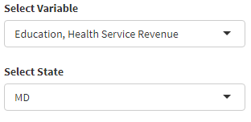
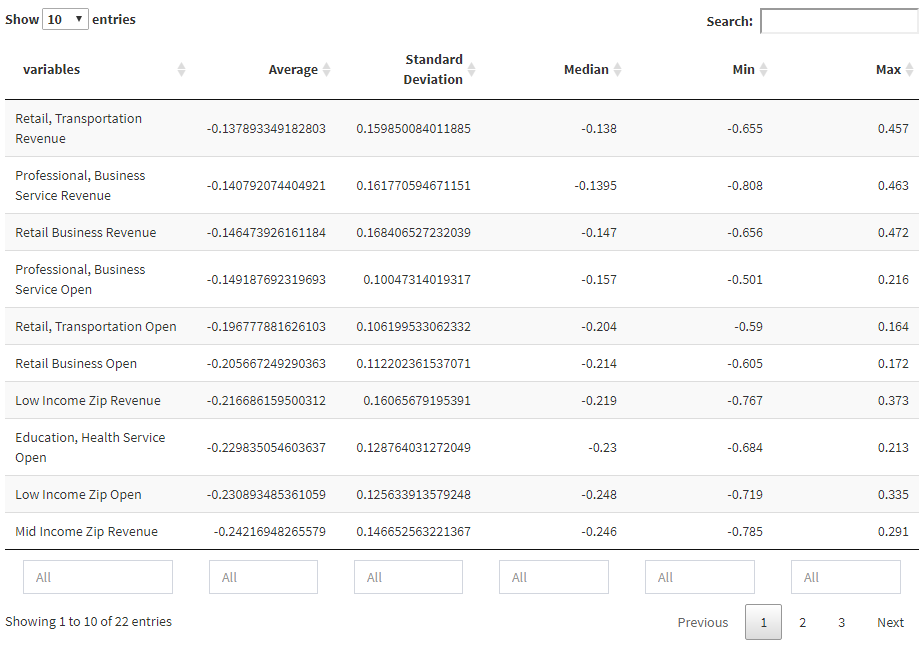
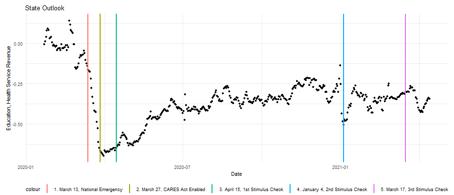
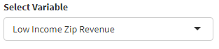
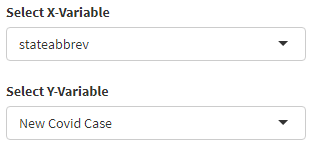
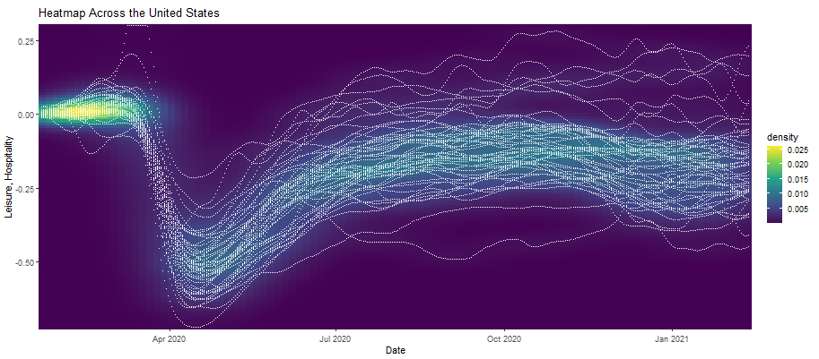
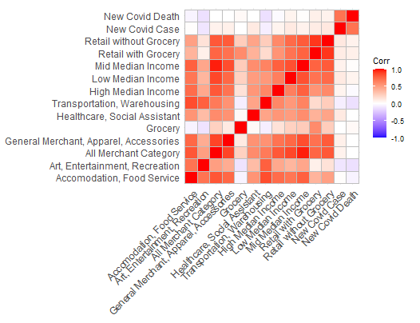
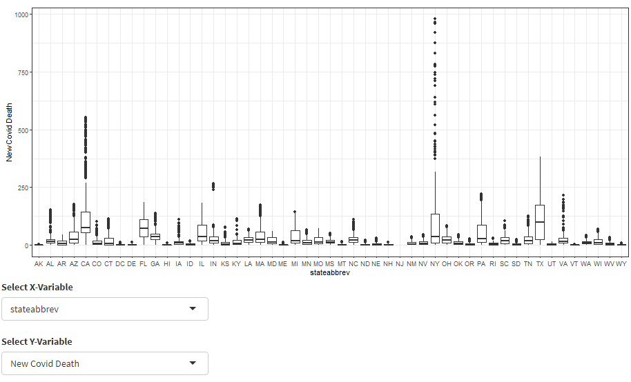
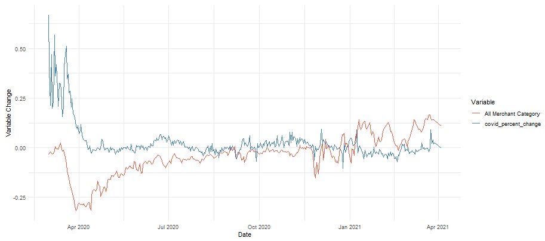

```{r setup, include=FALSE}
knitr::opts_chunk$set(echo = TRUE)
```

## Use Case {-}

Our app analyzes how COVID-19 positive cases impacted the U.S. economy, focusing 
on indicators such as consumer spending, open small business, and employment. 
The aim of the app is to discover how the number of positive COVID-19 cases 
influenced consumer spending across industries, as well as revealing how 
COVID-19 positive cases impacted small businesses or changes in employment.

Our target audience for this app is for federal and state level policy advisers
and analysts. By incorporating a variety of data sources and joining them 
together to display in an interactive dashboard, our goal is to allow those 
policy advisers to quickly interpret how COVID-19 has impacted various aspects 
of the economy on a state by state level. 
With our app, the user can answer questions such as:

* For consumer spending, which industries on average declined the most during the past year? 
  Which industries had the steepest drop? Which industry was affected the least?
* Does there appear to be a relationship between the stimulus checks and consumer spending?
* How did stimulus check help small businesses, consumer spending and employment, and how effective was it?
* Is there a correlation between percent changes in COVID-19 cases and small businesses’ open/revenue? 

***

## Required Packages {-}

* library(tidyverse)
  + For tidyverse packages and functions
  
* library(shiny)
  + For the Shiny app
  
* library(dashboardthemes)
  + For aesthetics on the Shiny app

* library(leaflet)
  + For an interactive map in the Shiny app

* library(ggcorrplot)
  + For plotting the correlation matrix

***

## Data Source and Structure {-}

The primary data sources are from Opportunity Insights' Economic Tracker, 
a public database which compiled data from various sources on consumer spending, 
open small businesses, employment. We then build upon these with
additional relevant datasets to supplement for exploratory data analysis and
statistical analysis.

* **Consumer Spending**  
  + Original Source: [Affinity Solutions](https://raw.githubusercontent.com/OpportunityInsights/EconomicTracker/main/data/Affinity%20-%20State%20-%20Daily.csv)
  
  Consumer spending is measured via aggregated and anonymized data on credit &
  debit card spending collected by Affinity, which is a company that aggregates 
  that information - the company captures nearly 10% of credit and debit card
  spending in the US. 
  
  The data seasonally adjusted credit & debit card spending relative to January 
  2020 and is daily (presented as a 7-day moving average). The data is broken
  down by industries (merchant codes used by Affinity Solutions) and income
  based on consumer zip code (the transactions are linked to zip codes where 
  the consumer lives and those zip codes are classified into income categories
  based on median household income from the American Community Survey)
  
  Number of Observations: 21713
  
  Date range: January 22, 2020 to April 4, 2021
  
  Industries: 
  + Accommodation, Food Service
  + Arts, Entertainment, Recreation
  + All Merchant Category
  + General Merchant, Apparel, Accessories
  + Grocery 
  + Healthcare, Social Assistant
  + Transportation, Warehousing
  + Retail with Grocery
  + Retail without Grocery
  
  Income:
  + High Median Income (median household income >$78,000)
  + Middle Median Income (median household income $46,000-78,000)
  + Low Median Income (median household income <$46,000)

***

* **Small Business Open**
  + Original Source: [Womply](https://raw.githubusercontent.com/OpportunityInsights/EconomicTracker/main/data/Womply%20-%20State%20-%20Daily.csv)
  
  Small businesses that are open are defined by those having financial 
  transaction activity. This data originates from Womply, a company that 
  aggregates data from credit card processors.
  
  The number of small businesses open is defined by having had at least one 
  transactions in the last 3 days and is daily (presented as a 7-day moving
  average). The data is broken down by industry (as defined by NAICS 
  supersector) and and income is based on business zip code (the transactions
  are linked to zip codes where the business is located and those zip codes are
  classified into income categories based on median household income from the
  American Community Survey).
  
  Number of Observations: 22434
  
  Date range: January 22, 2020 to April 14, 2021
  
  Industries: 
  + Education, Health Services Revenue
  + Education, Health Services Open
  + Leisure, Hospitality Revenue
  + Leisure, Hospitality Open
  + Professional, Business Services Revenue
  + Professional, Business Services Open
  + Retail, Transportation Revenue
  + Retail, Transportation Open
  + All Revenue
  + All Open
  
  Income:
  + High Income (median household income >$78,000)
  + Middle Income (median household income $46,000-78,000)
  + Low Income (median household income <$46,000)
  
***

* **Employment**
  + Original Source: [Paychex, Intuit, Earnin, Kronos](https://raw.githubusercontent.com/OpportunityInsights/EconomicTracker/main/data/Employment%20-%20State%20-%20Daily.csv)
  
  The employment data is combined via several data sources. Employment measures
  the changes in employment rates based on payroll data from Paychex and Intuit,
  worker-level data on employment and earnings from Earnin, and timesheet data
  from Kronos. 
  
  The data counts the number of active employees and is daily (presented as a 
  7-day moving average). The data is broken down by industries and wage levels.
  
  Number of Observations: 19788
  
  Date range: January 22, 2020 to February 12, 2021
  
  Industries: 
  + Education, Health Services
  + Leisure, Hospitality
  + Professional, Business Services
  + Retail, Transportation
  
  Wages:
  + High Income (>$60,000)
  + Middle Income ($27,000-60,000)
  + Low Income (<$27,000)  
  
***

We use additional data to join with the primary datasets (Consumer Spending, 
Small Business Open, Employment). Each of the 3 datasets also include data on 
the following:
  
* **COVID-19** 
  + Original Source: [Centers for Disease Control and Prevention](https://raw.githubusercontent.com/OpportunityInsights/EconomicTracker/main/data/COVID%20-%20State%20-%20Daily.csv)
  
  COVID-19 data consists of the number of cases and deaths daily (presented as
  a 7-day moving average) by state. The COVID-19 data is joined by the date and 
  statefips. Each observation includes a count of COVID-19 cases and death as
  new confirmed COVID-19 cases/deaths per 100,000 people, presented as a 7-day
  moving average.
  
* **GeoIDs - State**
  + Original Source: [Opportunity Insights](https://raw.githubusercontent.com/OpportunityInsights/EconomicTracker/main/data/GeoIDs%20-%20State.csv)
  
  The GeoID data uses 'statefips' as the geographic identifier in which we 
  joined with the primary datasets. The GeoID data provides the state name, 
  2-letter state abbreviation, and the state population in 2019 from Census
  Bureau estimates.
  
* **State Lockdown**

  The State Lockdown data includes information on how many days in lockdown
  each state has been under. This data uses 'statefips' as the geographic 
  identifier, and includes the dates when the lockdown started/ended.

***
  
## Exploratory Data Analysis {-}

### Inputs

* **Descriptive Plot** 
  + Select variables on industries and income/wages from Consumer Spending, 
  Small Business Open and Employment data
  + Select state 
  
  


### Outputs

* **Descriptive Statistics** 
  + Table that displays the average, standard deviation, median, minimum, and 
  maximum for each variable
  
{width=50%}

***

* **Descriptive Plot** 
  + A line graph showing selected variable in the selected state with milestones
  of national emergency declaration, CARES Act and stimulus checks sent

{width=50%}

## Statistical Analysis {-}

### Inputs

* **Density Plot** 
  + Select variables on industries and income/wages from Consumer Spending, 
  Small Business Open and Employment data
  
  

***
  
* **Bivariate Analysis** 
  + X and Y variables on industries and income/wages from Consumer Spending, 
  Small Business Open and Employment data
  
  

  
### Outputs

* **Density Plot** 
  + Displays a density plot of the selected variable.
  
  {width=50%}


***

* **Correlation Matrix** 
  + Displays the correlation between variables. For Small Business Open, shows
  two matrix (One for 'open', another for 'revenue;).
  
  {width=50%}

***

* **Bivariate Analysis**
  + If input X variables is continuous, displays scatter plot showing the 
  relationship between selected variables. If input X variable is categorical,
  displays boxplots showing the relationship between selected variables.
  
  {width=50%}

***

* **Time Series** 
  + Line plot between selected variable and the COVID-19 percentage change.
  
  {width=50%}


## References {-}

Alexander, D., & Karger, E. (2021). *Do Stay-at-Home Orders Cause People to Stay at Home? Effects of Stay-at-Home Orders on Consumer Behavior.* Federal Reserve Bank of Chicago; https://www.chicagofed.org/publications/working-papers/2020/2020-12

Bartik, A. W., Bertrand, M., Lin, F., Rothstein, J., & Unrath, M. (2020). *Measuring the labor market at the onset of the COVID-19 crisis.* Brookings. https://www.brookings.edu/wp-content/uploads/2020/06/Bartik-et-al-conference-draft.pdf

Chetty, R., Friedman, J. N., Hendren, N., & Stepner, M. (2020). *The Economic Impacts of COVID-19: Evidence from a New Public Database Built Using Private Sector Data.* Opportunity Insights. https://opportunityinsights.org/wp-content/uploads/2020/05/tracker_paper.pdf

